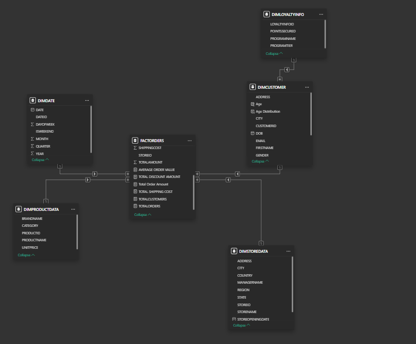
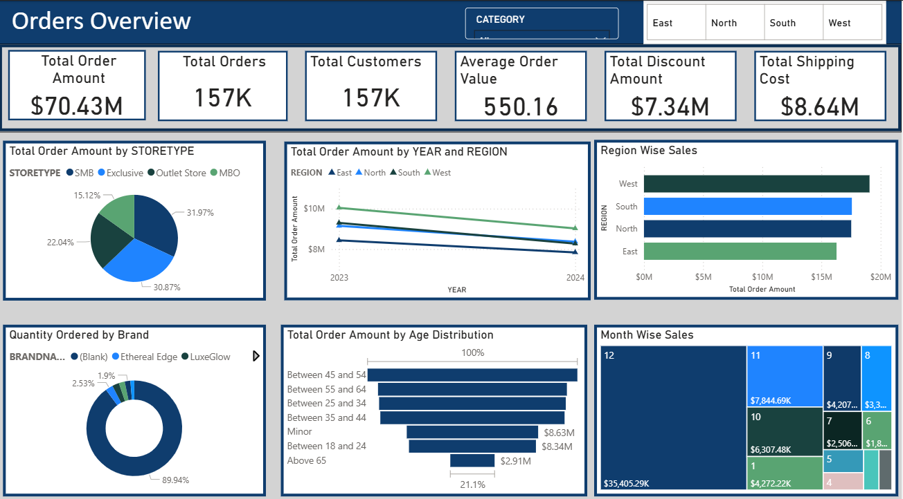

# StorePulse : Retail BI Data Warehousing Project

A comprehensive BI solution for retail analytics, built using Snowflake, Power BI, and Python.

---


## 🏗️ Architecture

This solution implements a modern BI architecture with three main components:

1. **Data Generation & Processing**
   - Python scripts for synthetic data generation
   - Dimensional modeling approach
   - Automated data pipeline

2. **Data Warehouse**
   - Snowflake cloud data platform
   - Star schema design
   - Optimized for analytical queries

3. **Data Visualization**
   - Power BI dashboards
   - Interactive reports
   - Real-time analytics

## 📁 Project Structure

```
├── data/                      # Raw data files
│   ├── DimLoyaltyInfo.csv
│   ├── DimDate.csv
│   ├── DimProductData.csv
│   ├── DimStoreData.csv
│   ├── DimCustomerData.csv
│   └── factorders.csv
│
├── ER Diagrams + Starter Files/
│   ├── ER.xlsx               # Entity-Relationship diagram
│   └── LookupFile.xlsx       # Reference data
│
├── snowflake + query commands/
│   ├── snowflake_documentation.md
│   └── snowflake_queries.md
│
├── python files/
│   ├── Burst_Sales_Data.py
│   ├── Historical_Sales_Data.py
│   ├── DateDimension.py
│   ├── DimProductData.py
│   ├── DimStoreData.py
│   └── DimCustomerData.py
│
└── PowerBI file/
    └── pbi.pbix              # Power BI dashboard
```

## 🛠️ Technical Stack

- **Data Warehouse**: Snowflake
- **ETL/Data Generation**: Python
- **Visualization**: Power BI
- **Data Modeling**: Dimensional Modeling (Star Schema)

## 📊 Key Features

### Data Model
- **Dimension Tables**
  - DimLoyaltyInfo
  - DimDate
  - DimProductData
  - DimStoreData
  - DimCustomerData

- **Fact Table**
  - FactOrders

### Power BI Dashboard
- **Key Metrics**
  - Total Sales
  - Total Orders
  - Total Customers
  - Average Order Value
  - Total Discount
  - Total Shipping Cost

- **Visualizations**
  - Store Type Analysis (Pie Chart)
  - Regional Sales Trends (Line Chart)
  - Region-wise Amount (Clustered Bar Chart)
  - Order per Brand Analysis (Donut Chart)
  - Age Group Analysis (Bar/Funnel Chart)
  - Month Wise Sales Analysis (Tree Map)


## 🗂️ Data Model & Schema



*Star schema data model: FactOrders at the center, connected to dimension tables (DimDate, DimProductData, DimStoreData, DimCustomer, DimLoyaltyInfo). This structure enables efficient analytical queries and flexible reporting.*

---

## 📊 Final Dashboard



*An interactive Power BI dashboard providing insights into sales, orders, customers, discounts, shipping, and more. Visuals include KPIs, pie charts, bar charts, line charts, and treemaps for deep business analysis.*

---

## 🚀 Getting Started

### Prerequisites
- Snowflake account
- Power BI Desktop
- Python 3.x
- Required Python packages (pandas, numpy)

### Setup Instructions
1. Clone the repository
2. Set up Snowflake environment using commands in `snowflake_documentation.md`
3. Run Python scripts to generate test data
4. Load data into Snowflake using provided SnowSQL commands
5. Open Power BI file and connect to Snowflake

## 📈 Business Value

This solution enables:
- Real-time sales monitoring
- Customer behavior analysis
- Store performance tracking
- Loyalty program effectiveness
- Product category insights
- Regional performance analysis

## 🔒 Security

- Secure Snowflake connection
- Role-based access control
- Encrypted data transmission

## 🤝 Contributing

1. Fork the repository
2. Create your feature branch
3. Commit your changes
4. Push to the branch
5. Create a Pull Request

## 📝 License

This project is licensed under the MIT License - see the LICENSE file for details.

## 👥 Authors

- Your Name - Initial work

## 🙏 Acknowledgments

- Snowflake for cloud data platform
- Microsoft Power BI for visualization
- Python community for data processing libraries 
